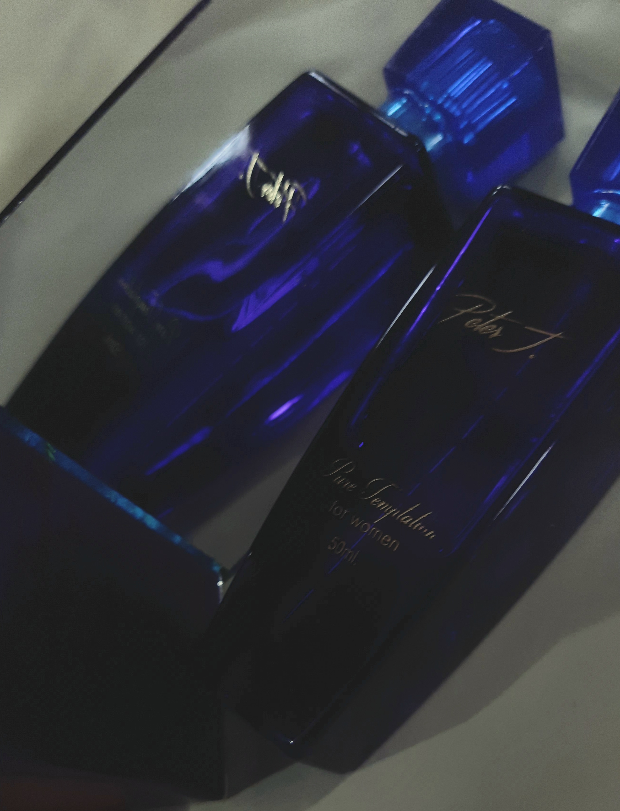
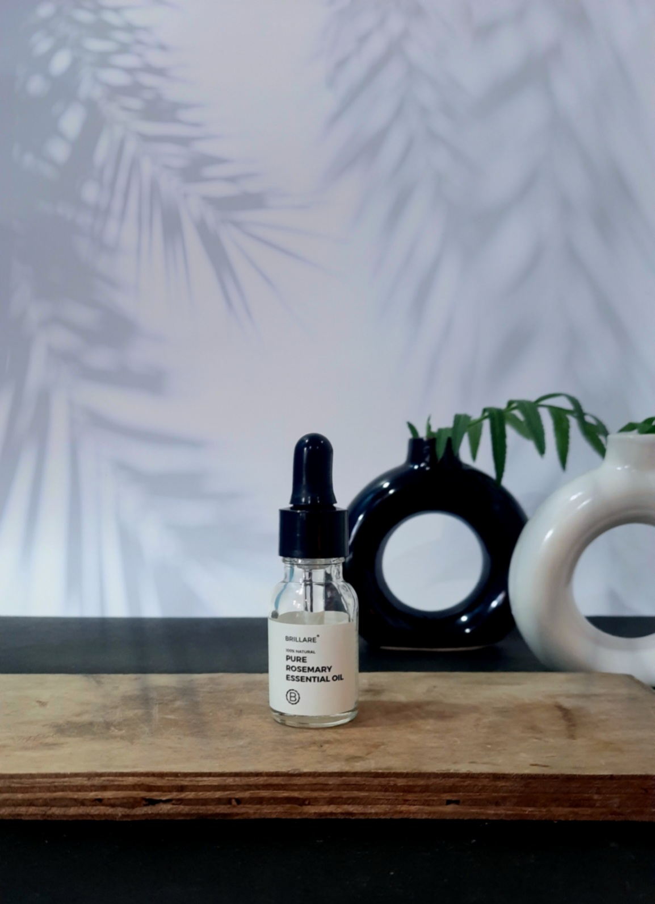
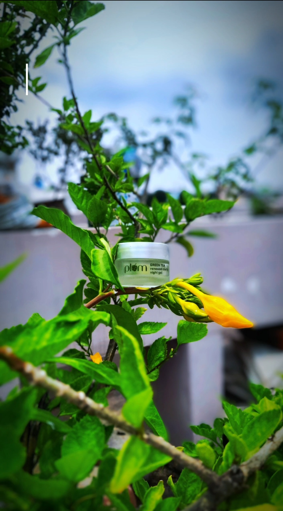

<!DOCTYPE html>
<html lang="en">

    <head>
        <meta charset="UTF-8">
        <meta name="viewport" content="width=device-width, initial-scale=1.0">
        <title>kuchbhi.ugc</title>
        
    </head>

    <body>
        <header>
            <h1>kuchbhi.ugc</h1>
            
            <nav>
                <ul>
                    <li><a href="#about">About Us</a></li>
                    <li><a href="#benefits">Benefits</a></li>
                    <li><a href="#pricing">Pricing</a></li>
                    <li><a href="#portfolio">Portfolio</a></li>
                    <li><a href="#contact">Contact</a></li>
                </ul>
            </nav>
        </header>

        <section id="about">
            <h2>About Us</h2>
            

                
At kuchbhi.ugc, we specialize in creating personalized, creative content. We believe in delivering
                    value to our clients with high-quality, engaging, and authentic UGC videos and images.

                
Our mission is to craft content that resonates with your brand’s voice and audience while keeping
                    things creative and fresh.

            

        </section>

        <section id="benefits">
            <h2>Why Work With Us?</h2>
            <ul>
                <li>Affordable and value-driven services</li>
                <li>Unlimited revisions for satisfaction</li>
                <li>Tailored content based on your needs</li>
                <li>Professional, reliable service with quick turnaround</li>
            </ul>
        </section>

        <section id="pricing">
            <h2>Pricing</h2>
            

                <h3>Basic Bundle</h3>
                
1 video - ₹1000

            

            

                <h3>Standard Bundle</h3>
                
3 videos - ₹2500

            

            

                <h3>Premium Bundle</h3>
                
5 videos - ₹4000

            

            
*Prices are negotiable

        </section>

        <section id="portfolio">
            <h2>Portfolio</h2>
            

                <h2>Images<h2>
                
                
                
                
                
                <h2>Videos</h2>
                <video src="peterj.mp4" controls></video>
                <video src="brillsire.mp4" controls></video>
                <video src="]plumgel.mp4" controls></video>
                <video src="aqualogica moisturizer.mp4" controls></video>
            

        </section>

        <section id="contact">
            <h2>Contact Us</h2>
            
Email: kuchbhi.ugc@gmail.com

            
Phone: +91-9778080355

            
WhatsApp: +91-9861228564

        </section>

        <footer>
            
Follow us:
                <a href="https://www.instagram.com/kuchbhi.ugc/?__pwa=1">Instagram</a> |
                <a href="">YouTube</a>http://www.youtube.com/@kuchbhi._ugc
            

        </footer>

        
    </body>

</html>
