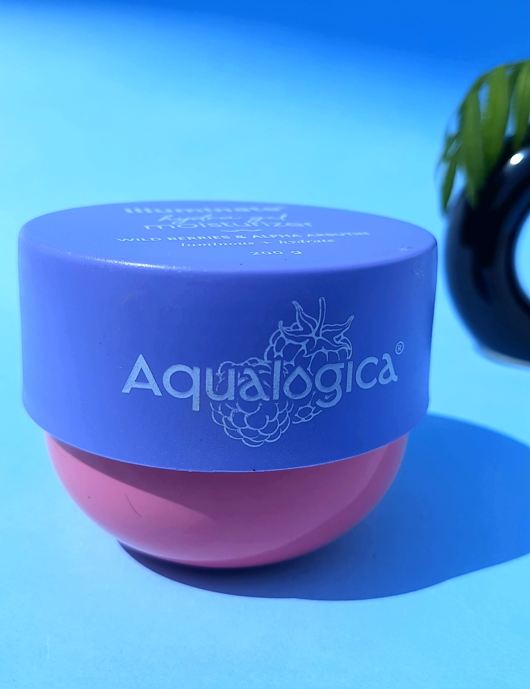

    <head>
        <meta charset="UTF-8">
        <meta name="viewport" content="width=device-width, initial-scale=1.0">
        <title>KuchBhi.UGC</title>
        
        
       
    </head>

    <body>
        <i
        <header>
            <h1>KuchBhi.UGC</h1>
            
We Create High-Quality UGC Content Tailored to Your Needs

        </header>
        <nav>
            <a href="#portfolio">Portfolio</a>
            <a href="#about">About Us</a>
            <a href="#pricing">Pricing</a>
            <a href="#contact">Contact</a>
            
        </nav>
        

            <h2>Welcome to KuchBhi.UGC</h2>
            
Quality content that drives results.

        

        <section id="portfolio" class="section portfolio">
            <h2>Portfolio</h2>
            
Here’s some of our recent work:

            <h2> video </h2>
            <video controls src="aqualogica moisturizer (1).mp4"></video>
            <video controls src="brillsire.mp4"></video>
            <video controls src="peterj.mp4"></video>
            <video controls src="]plumgel (10).mp4"></video>
            <h2> Images </h2>
            
            
            
            
            
        </section>
        <section id="about" class="section about">
            <h2>About Us</h2>
            
We are UGC creators dedicated to delivering quality, cost-friendly content. Our goal is to exceed
                expectations with revisions and high-quality results until clients are fully satisfied.

            <h3>Why Work With Us?</h3>
            <ul>
                <li>Cost-effective solutions</li>
                <li>Unlimited revisions</li>
                <li>Tailored, high-quality content</li>
                <li>Focused on client satisfaction</li>
            </ul>
        </section>
        <section id="pricing" class="section pricing">
            <h2>Pricing</h2>
            

                <h3>Bundle 1</h3>
                
1 Video

                
Price: ₹1000

            

            

                <h3>Bundle 2</h3>
                
3 Videos + 2 Images

                
Price: ₹2500

            

            

                <h3>Bundle 3</h3>
                
5 Videos + 5 Images

                
Price: ₹4500

            

            
Note: Prices are negotiable!

        </section>
        <section id="contact" class="section contact">
            <h2>Contact Us</h2>
            
Email: kuchbhi.ugc@gmail.com 

            
Phone: +91 9778080355

            
WhatsApp: +91 9861228564

            
            <h3>Find Us Online:</h3>
            
Instagram: <a href="https://www.instagram.com/kuchbhi.ugc/?__pwa=1" style="color: #10375b;">@kuchbhi.ugc</a>

           
        </section>
        <footer>
            
&copy; 2024 KuchBhi.UGC | All Rights Reserved

        </footer>
    </body>

</html>
